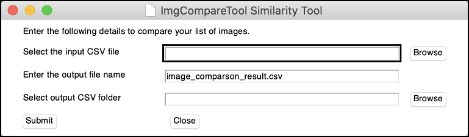

# ImgCompareTool

ImgCompareTool is a Python (3.x) package for determining the similarity of pairs of images.

## Image Similarity

In broad strokes, two pictures are similar when they have the same colours in the same places. This can sometimes be complicated if a photo has undergone a transformation (e.g. rotated, cropped, brightened/darkened).

The measure of similarity should be sensitive to:

·     Colour properties (hue, tint/shade, etc.)

·     Colour location

On the other hand, the measure should be less sensitive to:

·     Image format (jpg, png, bmp, etc.)

·     Aspect ratio/cropping

·     Resolution

·     Rotation

The ImgCompareTool uses the imagehash package for Python to calculate the similarity measure.

[Github imagehash repository](https://github.com/JohannesBuchner/imagehash)

## Installation

ImgCompareTool can be used in two ways: as a Python (3.x) package to use in your own script or, alternatively, as a portable application with a graphical user interface (available for Windows and MacOS).

#### Portable application

###### Windows 10

Download the current release of ImgCompareTool-win10.exe, located on the [releases](https://gitlab.com/kvonkoni/imgcomparetool/-/releases) page, to your desired location and run the application.

###### Mac OS 10.15

Download and extract ImgCompareTool-macos-10.15.zip, located on the [releases](https://gitlab.com/kvonkoni/imgcomparetool/-/releases) page, to your desired location. Run the ImgCompareTool file in the extracted directory.

###### Mac OS 10.14

Due to a known bug in OS 10.14 (Mojave) that causes Tkinter-based applications compiled using PyInstaller to crash the system, ImgCompareTool must be run using a Python (3.x) interpreter when using this operating system.

To run the graphical application on OS 10.14, use the following steps:

```bash
>> python setup.py install
>> python ui.py
```

#### Python package (platform-independent)

To install the Python package, simply clone the repository to any location and run

```bash
>> python setup.py install
```

from the repository's root directory. Requisite packages can be found in [requirements.txt](requirements.txt) and will be installed automatically.

To use the ImgCompileTool GUI from your Python (3.x) interpreter, simple copy the ui.py file from the repository to a location of your choice and run

```bash
>> python ui.py
```

Since this package uses PySimpleGUI, the graphical interface will work on Windows, MacOS, and Linux.

## Usage

The tool compares a list of image pairs for similarity.

#### Input

The tool takes as input the path to a .csv file with two fields (image1 and image2), representing the full path to image1 and image2, respectively. The .csv should contain a header row.

Example of an input .csv:

| image1 | image2 |
|------------|-------------|
| <full path>/image1a.png | <full path>/image2a.png |
| <full path>/image1b.png | <full path>/image2b.png |
| <full path>/image1c.png | <full path>/image2c.png |
| <full path>/image1d.png | <full path>/image2d.png |

#### Output

The tool outputs a .csv file with four fields (image1, image2, similarity, and elapsed), representing the full path to image1, the full path to image2, the measure of similarity, and the elapsed time in seconds, respectively. The more similar the images, the lower the similarity measure, with identical images having a similarity measure of 0.

Example of an output .csv:

| image1 | image2 | similarity | elapsed |
|------------|-------------|-------------|-------------|
| <full path>/image1a.png | <full path>/image2a.png | 0 | 0.157 |
| <full path>/image1b.png | <full path>/image2b.png |5 | 0.99845 |
| <full path>/image1c.png | <full path>/image2c.png |20 | 1.6885 |
| <full path>/image1d.png | <full path>/image2d.png |35 | 0.824 |

#### Portable application

The portable application has three fields.



**Select the input CSV file**: Click browse to select the input .csv file, or type its full path into the textbox.

**Enter the output file name**: Type in the name for the output .csv file. Default is image_comparison_result.csv.

**Select output CSV folder**: Click browse to select the output folder, or type its full path into the textbox. Must have write permissions on the selected folder.

Click the **Submit** button to run the application.

#### Python package

The package can be used as part of a Python script using the ImageList class.

Usage of the package is illustrated using the following minimal example:

```python
#!/usr/bin/env python

"""minimal_example.py: a minimal example for the imgcomparetool package"""

from imgcomparetool import ImageList

def main():
    
    # Loading and comparing images
    image_list = ImageList('test_image_input.csv')
    image_list.compare('test_image_output.csv')

if __name__ == '__main__':
    main()
```

class **imgcomparetool.ImageList( input_filename )**

Parameters:

* input_filename: string
  * the full or relative path to the input CSV file listing the pairs of images.

method **imgcomparetool.ImageList.compare( output_filename )**

Parameters:

* output_filename: string
  * the full or relative path to the output CSV file listing the pairs of images, similarity, and elapsed time.

## Build and Release

#### Portable application

###### Windows 10

To compile new versions of the portable applications on Windows, run the following command from the root of the repository:

```bash
>> pyinstaller --onefile --add-data <Path to Python>\Lib\site-packages\imagehash;imagehash --clean --noconsole --noconfirm --name ImgCompareTool ui.py
```
Note that, due to a bug in the imagehash package, you must force PyInstaller to include the package directory using the --add-data flag. To do so, replace "<Path to Python>\Lib\site-packages\imagehash" with the path to imagehash package on your environment.

The above command will create a single .exe file that can be run by the end-user on Windows. Distribute it to the end-users by making a new release on the repository. Upload the .exe to the release folder and add a link to it in the release's tag notes.

###### Mac OS 10.15

To compile new versions of the portable application on MacOS (10.15 or later), run the following command from the root of the repository:

```bash
>> pyinstaller --add-data /Library/Frameworks/Python.framework/Versions/3.8/lib/python3.8/site-packages/imagehash:imagehash --add-data /Library/Frameworks/Python.framework/Versions/3.8/lib/tcl8.6:tcl --add-data /Library/Frameworks/Python.framework/Versions/3.8/lib/tk8.6:tk --clean --noconsole --noconfirm --name ImgCompareTool ui.py
```
Note that, due to a known bug in the PyInstaller for MacOS, you must force PyInstaller to include the imagehash, Tk, and Tcl package directories using the --add-data flag. Tk and Tcl are required for the GUI application Tkinter, which is a dependency of PySimpleGUI. Replace the above paths to these directories with the appropriate ones from your environment.

Compress the ImgCompareTool directory and distribute this to the end-users by making a new release in the repository. Upload the .zip to the release folder and add a link to it in the release's tag notes. The tool cannot be run from the .app file since the software is not signed.

###### Mac OS 10.14

Due to the bug mentioned in [Installation](#Installation), the application must be run through a Python interpreter for this operating system. Therefore, there is no need to build and release a portable application.

#### Python package (platform-independent)

Version information for the package is stored in the setup.py file in the root of the repository. Make sure to update the version parameter during releases.

```python
setup(  name='imgcomparetool',
        version='0.1.0',
        ...
     )
```

## Testing

The ImgCompareTool package includes a unit test script.

While image similarity can sometimes be subjective, testing the compare method of the tool should enforce an agreed-upon similarity order for test images.

The unit test passes when five pairs of images are ranked in the correct order, from most similar to least similar.

The test image pairs:


The top pair of images should have a similarity measure of 0, since they are identical. The second pair differs only by a colour filter applied to the right picture. In the third pair, the right image is an imitation of the left one, but differs significantly. The fourth pair are similar in average colour, but differ in every other way. Finally, the bottom pair differ significantly in both content and colour.

The ImgCompareTool agrees with this order, giving the pairs similarity measures of 0, 2, 23, 25, and 34 (from top to bottom). The scores themselves are not as important as the order. The script unit_tests.py asserts this order, passing when the image pairs are ranked in this order.

## Contributing

Pull requests are welcome. For major changes, please open an issue first to discuss what you would like to change.

Please make sure to update tests as appropriate.

## License
[MIT](LICENSE)